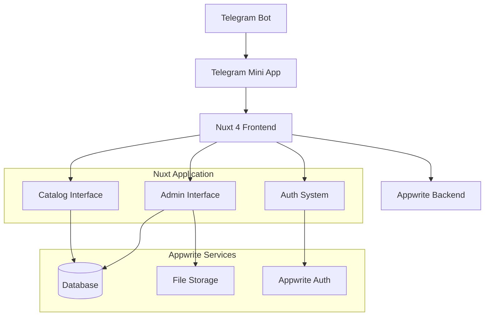
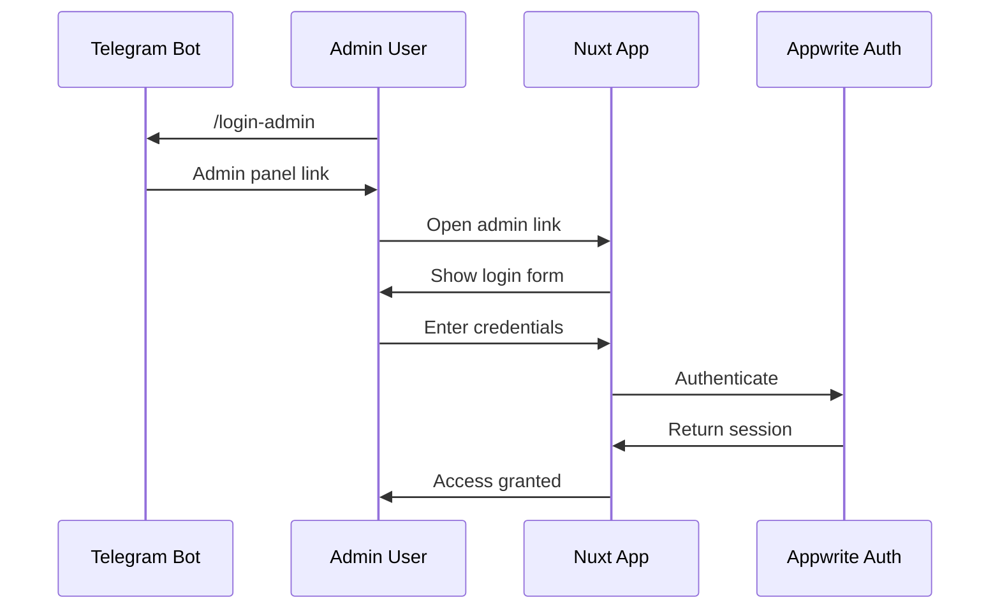

# Документ дизайна

## Обзор

TMA Catalog Bot представляет собой Telegram Mini App с двумя основными интерфейсами: пользовательский каталог для просмотра товаров и административная панель для управления контентом. Система построена на Nuxt 4 с использованием Nuxt UI для компонентов интерфейса, Appwrite в качестве бэкенда и поддерживает многоязычность через @nuxtjs/i18n.

## Архитектура

### Общая архитектура системы



### Архитектура приложения

**Frontend Stack:**

- Nuxt 4 (SSR отключен для SPA режима)
- Nuxt UI для компонентов интерфейса
- @nuxtjs/i18n для многоязычности
- vue-tg для интеграции с Telegram WebApp API
- TypeScript для типизации

**Backend Stack:**

- Appwrite Database для хранения данных
- Appwrite Storage для изображений
- Appwrite Auth для авторизации администраторов

**Deployment:**

- GitHub Pages (статическая генерация)
- Telegram Bot с Web App кнопкой

## Компоненты и интерфейсы

### Структура маршрутов

```
/                           # Главная страница каталога
/category/[slug]            # Страница категории с товарами
/product/[slug]             # Детальная страница товара
/admin                      # Вход в админ-панель
/admin/dashboard            # Дашборд администратора
/admin/categories           # Управление категориями
/admin/categories/create    # Создание категории
/admin/categories/[id]      # Редактирование категории
/admin/products             # Управление товарами
/admin/products/create      # Создание товара
/admin/products/[id]        # Редактирование товара
```

### Layouts

#### Default Layout (`layouts/default.vue`)

Используется для пользовательского каталога:

- MainHeader с переключателем языка
- UContainer для контента
- UFooter с информацией о приложении
- Telegram theme colors integration

#### Admin Layout (`layouts/admin.vue`)

Используется для административной панели:

- Sidebar с навигацией по админ-функциям
- Breadcrumbs для навигации
- User menu с выходом
- Responsive design для desktop/tablet

### Ключевые компоненты

#### Пользовательский интерфейс

**CategoryCard.vue**

```vue
<template>
	<UCard class="category-card">
		<div class="flex items-center space-x-4">
			<div class="text-2xl">{{ category.icon }}</div>
			<div class="flex-1">
				<h3 class="font-semibold">{{ category.name[locale] }}</h3>
				<p class="text-sm text-muted">{{ productCount }} товаров</p>
			</div>
		</div>
	</UCard>
</template>
```

**ProductCard.vue**

```vue
<template>
	<UCard class="product-card">
		
		<div class="p-4">
			<h3 class="font-semibold">{{ product.name[locale] }}</h3>
			<p class="text-primary font-bold">{{ formatPrice(product.price) }}</p>
			<UBadge v-if="!product.isAvailable" color="red">Недоступен</UBadge>
		</div>
	</UCard>
</template>
```

**ProductGallery.vue**

```vue
<template>
	<div class="product-gallery">
		<UCarousel v-slot="{ item }" :items="images" arrows dots class="w-full">
			
		</UCarousel>
	</div>
</template>
```

**ContactButton.vue**

```vue
<template>
	<UButton @click="openTelegramChat" color="primary" size="lg" block icon="i-lucide-message-circle">
		Связаться
	</UButton>
</template>
```

#### Административный интерфейс

**AdminSidebar.vue**

```vue
<template>
	<aside class="admin-sidebar">
		<nav>
			<UVerticalNavigation :links="navigationLinks" />
		</nav>
	</aside>
</template>
```

**CategoryForm.vue**

```vue
<template>
	<UForm :schema="categorySchema" @submit="onSubmit">
		<UFormGroup label="Название (EN)" name="name.en">
			<UInput v-model="form.name.en" />
		</UFormGroup>
		<UFormGroup label="Название (RU)" name="name.ru">
			<UInput v-model="form.name.ru" />
		</UFormGroup>
		<!-- Остальные поля -->
	</UForm>
</template>
```

**ProductForm.vue**

```vue
<template>
	<UTabs :items="formTabs">
		<template #basic>
			<!-- Основная информация -->
		</template>
		<template #pricing>
			<!-- Цена и доступность -->
		</template>
		<template #images>
			<ImageUpload v-model="form.images" />
		</template>
		<template #features>
			<!-- Характеристики -->
		</template>
	</UTabs>
</template>
```

**ImageUpload.vue**

```vue
<template>
	<div class="image-upload">
		<UFileUpload v-model="files" multiple accept="image/*" @change="onFileSelect" />

		<div class="grid grid-cols-3 gap-4 mt-4">
			<div v-for="(image, index) in images" :key="index" class="relative">
				
				<UButton
					@click="removeImage(index)"
					icon="i-lucide-x"
					color="red"
					variant="ghost"
					size="xs"
					class="absolute top-1 right-1"
				/>
			</div>
		</div>
	</div>
</template>
```

**DataTable.vue**

```vue
<template>
	<div class="data-table">
		<div class="table-controls">
			<UInput v-model="search" placeholder="Поиск..." />
			<USelect v-model="statusFilter" :options="statusOptions" />
		</div>

		<UTable :rows="filteredData" :columns="columns" :loading="loading" @select="onRowSelect">
			<template #actions="{ row }">
				<UDropdown :items="getRowActions(row)">
					<UButton icon="i-lucide-more-horizontal" variant="ghost" />
				</UDropdown>
			</template>
		</UTable>

		<UPagination v-model="page" :page-count="pageCount" :total="total" />
	</div>
</template>
```

## Модели данных

### TypeScript интерфейсы

```typescript
// types/category.ts
export interface Category {
	$id: string
	name: {
		en: string
		ru: string
	}
	description: {
		en: string
		ru: string
	}
	icon: string
	slug: string
	sortOrder: number
	isActive: boolean
	createdAt: string
	updatedAt: string
}

// types/product.ts
export interface Product {
	$id: string
	categoryId: string
	name: {
		en: string
		ru: string
	}
	description: {
		en: string
		ru: string
	}
	price: number
	priceUnit: string
	images: string[]
	slug: string
	features: {
		en: string[]
		ru: string[]
	}
	isAvailable: boolean
	isActive: boolean
	sortOrder: number
	contactMessage: {
		en: string
		ru: string
	}
	createdAt: string
	updatedAt: string
}

// types/admin.ts
export interface AdminUser {
	$id: string
	email: string
	name: string
	role: 'admin' | 'superadmin'
	isActive: boolean
	createdAt: string
}
```

### Appwrite Collections Schema

**Categories Collection:**

```json
{
	"name": {
		"type": "object",
		"required": true,
		"properties": {
			"en": { "type": "string", "size": 255 },
			"ru": { "type": "string", "size": 255 }
		}
	},
	"description": {
		"type": "object",
		"properties": {
			"en": { "type": "string", "size": 1000 },
			"ru": { "type": "string", "size": 1000 }
		}
	},
	"icon": { "type": "string", "size": 100 },
	"slug": { "type": "string", "size": 255, "required": true },
	"sortOrder": { "type": "integer", "default": 0 },
	"isActive": { "type": "boolean", "default": true }
}
```

**Products Collection:**

```json
{
	"categoryId": { "type": "string", "size": 36, "required": true },
	"name": {
		"type": "object",
		"required": true,
		"properties": {
			"en": { "type": "string", "size": 255 },
			"ru": { "type": "string", "size": 255 }
		}
	},
	"description": {
		"type": "object",
		"properties": {
			"en": { "type": "string", "size": 5000 },
			"ru": { "type": "string", "size": 5000 }
		}
	},
	"price": { "type": "double", "required": true },
	"priceUnit": { "type": "string", "size": 50, "required": true },
	"images": { "type": "array", "items": { "type": "string" } },
	"slug": { "type": "string", "size": 255, "required": true },
	"features": {
		"type": "object",
		"properties": {
			"en": { "type": "array", "items": { "type": "string" } },
			"ru": { "type": "array", "items": { "type": "string" } }
		}
	},
	"isAvailable": { "type": "boolean", "default": true },
	"isActive": { "type": "boolean", "default": true },
	"sortOrder": { "type": "integer", "default": 0 },
	"contactMessage": {
		"type": "object",
		"properties": {
			"en": { "type": "string", "size": 500 },
			"ru": { "type": "string", "size": 500 }
		}
	}
}
```

## Обработка ошибок

### Простая обработка ошибок

```typescript
// composables/useErrorHandler.ts
export const useErrorHandler = () => {
	const toast = useToast()

	const handleError = (error: Error) => {
		console.error('Error:', error)

		toast.add({
			title: 'Ошибка',
			description: 'Что-то пошло не так',
			color: 'red'
		})
	}

	return { handleError }
}
```

### Основные типы ошибок

1. **Сетевые ошибки**: Показ уведомления
2. **Ошибки форм**: Показ ошибок под полями
3. **404 ошибки**: Простая страница "Не найдено"

## Стратегия тестирования

### Простые Unit тесты

```typescript
// tests/composables/useCategories.test.ts
import { describe, it, expect } from 'vitest'
import { useCategories } from '~/composables/useCategories'

describe('useCategories', () => {
	it('should initialize with empty categories', () => {
		const { categories } = useCategories()
		expect(categories.value).toBe(null)
	})

	it('should format category name correctly', () => {
		const category = { name: { en: 'Test', ru: 'Тест' } }
		const locale = 'ru'
		expect(category.name[locale]).toBe('Тест')
	})
})
```

### Простые Component тесты

```typescript
// tests/components/CategoryCard.test.ts
import { mount } from '@vue/test-utils'
import CategoryCard from '~/components/catalog/CategoryCard.vue'

describe('CategoryCard', () => {
	it('renders category name', () => {
		const category = {
			name: { en: 'Electronics', ru: 'Электроника' },
			icon: '📱'
		}

		const wrapper = mount(CategoryCard, {
			props: { category }
		})

		expect(wrapper.find('h3').text()).toContain('Electronics')
	})
})
```

### Основные тесты

- Проверка рендеринга компонентов
- Проверка базовой логики composables
- Проверка форматирования данных
- Проверка навигации между страницами

## Безопасность

### Простая авторизация администратора

**Admin Authentication Flow:**



**Middleware для защиты админ-маршрутов:**

```typescript
// middleware/admin-auth.ts
export default defineNuxtRouteMiddleware(async (to, from) => {
	const { isAuthenticated } = useAuth()

	if (!isAuthenticated.value) {
		return navigateTo('/admin')
	}
})
```

**Простая проверка авторизации:**

```typescript
// composables/useAuth.ts
export const useAuth = () => {
	const isAuthenticated = ref(false)
	const user = ref(null)

	const login = async (email: string, password: string) => {
		try {
			const session = await account.createEmailPasswordSession(email, password)
			isAuthenticated.value = true
			user.value = session
			return true
		} catch (error) {
			return false
		}
	}

	const logout = async () => {
		await account.deleteSession('current')
		isAuthenticated.value = false
		user.value = null
		navigateTo('/admin')
	}

	return { isAuthenticated, user, login, logout }
}
```

### Основные меры безопасности

1. **Простая валидация**: Проверка обязательных полей в формах
2. **Авторизация**: Middleware проверяет авторизацию перед доступом к админ-страницам
3. **Безопасная загрузка файлов**: Проверка типов и размеров изображений
4. **HTTPS**: Все запросы через HTTPS

## Производительность и оптимизация

### Простая оптимизация

- **Lazy loading**: Ленивая загрузка изображений
- **Кеширование**: Простое кеширование данных на 5 минут
- **Минификация**: Автоматическая минификация при сборке
- **WebP изображения**: Оптимизация изображений

## Интеграция с Telegram

### WebApp Integration

```typescript
// composables/useTelegram.ts
export const useTelegram = () => {
	const webApp = ref<any>(null)
	const user = ref<any>(null)
	const themeParams = ref<any>(null)

	const init = () => {
		if (typeof window !== 'undefined' && window.Telegram?.WebApp) {
			webApp.value = window.Telegram.WebApp
			user.value = webApp.value.initDataUnsafe?.user
			themeParams.value = webApp.value.themeParams

			// Configure WebApp
			webApp.value.ready()
			webApp.value.expand()
			webApp.value.enableClosingConfirmation()
		}
	}

	const openTelegramLink = (url: string) => {
		webApp.value?.openTelegramLink(url)
	}

	const showAlert = (message: string) => {
		webApp.value?.showAlert(message)
	}

	return {
		webApp,
		user,
		themeParams,
		init,
		openTelegramLink,
		showAlert
	}
}
```

### Theme Integration

```css
/* assets/css/telegram-theme.css */
:root {
	--tg-bg-color: var(--tg-theme-bg-color, #ffffff);
	--tg-text-color: var(--tg-theme-text-color, #000000);
	--tg-hint-color: var(--tg-theme-hint-color, #999999);
	--tg-link-color: var(--tg-theme-link-color, #2481cc);
	--tg-button-color: var(--tg-theme-button-color, #2481cc);
	--tg-button-text-color: var(--tg-theme-button-text-color, #ffffff);
}

body {
	background-color: var(--tg-bg-color);
	color: var(--tg-text-color);
}
```

## Развертывание

### GitHub Pages Deployment

```yaml
# .github/workflows/deploy.yml
name: Deploy to GitHub Pages

on:
    push:
        branches: [main]

jobs:
    deploy:
        runs-on: ubuntu-latest
        steps:
            - uses: actions/checkout@v3
            - uses: actions/setup-node@v3
              with:
                  node-version: '18'
            - run: npm install
            - run: npm run generate
            - uses: peaceiris/actions-gh-pages@v3
              with:
                  github_token: ${{ secrets.GITHUB_TOKEN }}
                  publish_dir: ./dist
```

### Environment Configuration

```env
# Production Environment Variables
APPWRITE_PUBLIC_ENDPOINT=https://cloud.appwrite.io/v1
APPWRITE_PUBLIC_PROJECT_ID=your-project-id
APPWRITE_PUBLIC_BD_KEY=your-database-id
APPWRITE_PUBLIC_COLLECTION_CATEGORIES_ID=categories-id
APPWRITE_PUBLIC_COLLECTION_PRODUCTS_ID=products-id
TELEGRAM_BOT_TOKEN=your-bot-token
```

### Bot Configuration

```typescript
// Telegram Bot Setup
const botCommands = [
	{ command: 'start', description: 'Открыть каталог' },
	{ command: 'login_admin', description: 'Вход в админ-панель' }
]

const webAppButton = {
	text: '🛍 Открыть каталог',
	web_app: {
		url: 'https://username.github.io/nuxt-tma-catalog/'
	}
}

const adminWebAppButton = {
	text: '⚙️ Админ-панель',
	web_app: {
		url: 'https://username.github.io/nuxt-tma-catalog/admin'
	}
}
```
