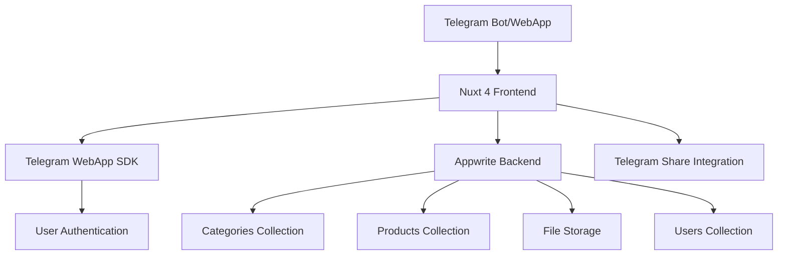

# Design Document

## Overview

The TMA Catalog is a minimal, production-ready catalog system built with Nuxt 4 frontend and Appwrite backend, designed specifically as a Telegram Mini App (TMA). The system enables public users to browse products and categories while providing admin capabilities for content management. Authentication is handled through Telegram WebApp integration, eliminating the need for separate login systems. The architecture follows a split-responsibility model with clear separation between frontend presentation and backend data management.

## Architecture

### High-Level Architecture



### Technology Stack

- **Frontend**: Nuxt 4 with Vue 3
- **Backend**: Appwrite (BaaS)
- **Database**: Appwrite Database Collections
- **File Storage**: Appwrite Storage
- **Authentication**: Telegram WebApp + Appwrite Auth
- **Localization**: nuxt-i18n
- **Integration**: Telegram WebApp SDK, vue-telegram package
- **TMA Integration**: vue-telegram or direct Telegram WebApp SDK

### Responsibility Split

**Frontend (Nuxt 4)**:

- UI rendering and routing
- Data fetching and state management
- Authentication state management
- Telegram share link generation
- Internationalization

**Backend (Appwrite)**:

- Data persistence and validation
- User authentication and authorization
- File storage and management
- Access control and permissions

## Components and Interfaces

### Frontend Structure

```
app/
├── layouts/
│   ├── default.vue               # Main layout with proper containers
│   └── admin.vue                 # Admin layout with navigation
├── pages/
│   ├── index.vue                 # Categories listing
│   ├── category/[id].vue         # Products by category
│   ├── product/[id].vue          # Product details
│   └── admin/
│       ├── index.vue             # Admin dashboard
│       ├── categories.vue        # Category management
│       └── products.vue          # Product management
├── components/
│   ├── CategoryCard.vue          # Category display component
│   ├── ProductCard.vue           # Product listing component
│   ├── ImageGallery.vue          # Product image viewer
│   ├── LanguageSwitcher.vue      # Localization control
│   └── TelegramAuth.vue          # Telegram authentication component
├── composables/
│   ├── useAuth.ts                # Telegram + Appwrite authentication
│   ├── useTelegramWebApp.ts      # Telegram WebApp integration
│   ├── useCategories.ts          # Category data management
│   └── useProducts.ts            # Product data management
├── plugins/
│   └── telegram.client.ts        # Telegram WebApp initialization
└── utils/
    └── appwrite.ts               # Appwrite SDK configuration
```

### Key Interfaces

**Category Interface**:

```typescript
interface Category {
	$id: string
	name: string
	slug: string
	$createdAt: string
	$updatedAt: string
}
```

**Product Interface**:

```typescript
interface Product {
	$id: string
	categoryId: string
	title: string
	description: string
	price: number
	images: string[]
	$createdAt: string
	$updatedAt: string
}
```

**Telegram User Interface**:

```typescript
interface TelegramUser {
	id: number
	first_name: string
	last_name?: string
	username?: string
	language_code?: string
	is_premium?: boolean
	photo_url?: string
}
```

**Telegram WebApp Data Interface**:

```typescript
interface TelegramWebAppData {
	user?: TelegramUser
	chat_instance?: string
	chat_type?: string
	auth_date: number
	hash: string
}
```

## Data Models

### Appwrite Collections Schema

**Categories Collection**:

- `name`: string (required, max 100 chars)
- `slug`: string (required, unique, max 100 chars)

**Products Collection**:

- `categoryId`: string (required, relationship to Categories)
- `title`: string (required, max 200 chars)
- `description`: text (optional, max 2000 chars)
- `price`: number (required, min 0)
- `images`: array of strings (file IDs from storage)

**Users Collection**:

- `telegramId`: number (required, unique, Telegram user ID)
- `firstName`: string (required, max 100 chars)
- `lastName`: string (optional, max 100 chars)
- `username`: string (optional, max 100 chars)
- `languageCode`: string (optional, max 10 chars)
- `isPremium`: boolean (default false)
- `photoUrl`: string (optional, max 500 chars)
- `isAdmin`: boolean (default false)
- `lastActive`: datetime (auto-updated)

**Storage Bucket**:

- `product-images`: For storing product image files
- Allowed file types: jpg, jpeg, png, webp
- Max file size: 5MB per image

### Access Control

**Public Permissions**:

- Categories: Read only
- Products: Read only
- Storage: Read only (for image display)

**Admin Permissions**:

- Categories: Full CRUD access
- Products: Full CRUD access
- Storage: Full access (upload, delete)

## Error Handling

### Frontend Error Handling

1. **Network Errors**: Display user-friendly messages with retry options
2. **Authentication Errors**: Redirect to login with appropriate messaging
3. **Validation Errors**: Show field-specific error messages
4. **File Upload Errors**: Display progress and error states

### Backend Error Handling

1. **Appwrite SDK Errors**: Catch and transform to user-friendly messages
2. **Permission Errors**: Handle unauthorized access gracefully
3. **Data Validation**: Server-side validation with clear error responses

### Error States

- Loading states for all async operations
- Empty states when no data is available
- Error boundaries for component-level failures
- Fallback images for missing product photos

## Testing Strategy

### Unit Testing

- Composables testing with mock Appwrite responses
- Component testing with Vue Test Utils
- Utility function testing

### Integration Testing

- API integration tests with Appwrite test environment
- Authentication flow testing
- File upload functionality testing

### End-to-End Testing

- Public user browsing flow
- Admin management workflows
- Cross-browser compatibility testing
- Mobile responsiveness testing

### Test Data Management

- Seed data for development environment
- Mock data for unit tests
- Test user accounts for different permission levels
